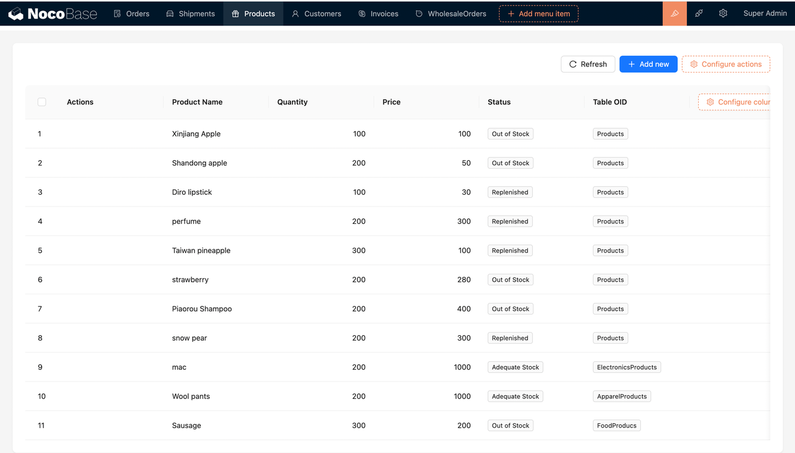

# 继承

## 配置字段包括继承的父表字段

子表在区块中使用时除了本表字段还有所有父表的字段供配置

## 添加操作可以启用子表

父表配置 TableOID(记录是由哪个表创建的数据)

子表的数据汇聚在父表中

在父表中为子表配置添加操作

可选项为当前表的所有子表

## 继承表数据的查看与编辑（按 \_\_collection 显示）

UI 配置状态下可以为子表配置区块（表单/详情区块）

非 UI 配置状态下,按 \_\_collection 只显示对应数据表记录的区块

## 关系数据的弹窗（按 \_\_collection 显示）

关系数据的详情在非 UI 配置状态下按 \_\_collection 仅显示对应数据的区块

## 继承下的筛选联动

B 可以连接 A，B 的子表 B1 也可以连接 A
