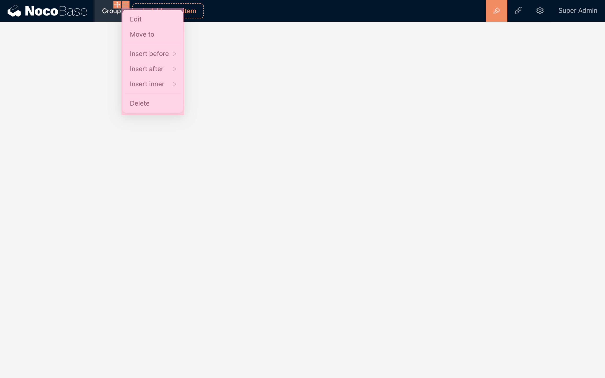

# Menus

Menus are used to organize pages and external links. In NocoBase's default page layout template, menus are located on the top and left side. In this case, the top side is the first level menu, and the left side is the second level and infinite levels of submenus.

## Menu Item Types

NocoBase has three built-in menu item types:

- Group
- Page
- Link

### Group

"Group" is used to group menu items, which can be on the top or left side. Within a group, you can continue to create groups, i.e. the menu can be infinitely hierarchical.

### Page

Page can be used as container for blocks, holding a wide variety of blocks. (See [pages and popups](. /pages/index.md) )

### Link

Can be used to jump to third-party URLs

## Configure Menu

Once you switch into UI Editor mode, there are two icons in the upper right corner of the menu item:

- Drag and drop to move
- Menu Item Configuration

### Menu Item Configuration

- Edit: includes menu item title, icon, etc.
- Move to: besides drag and drop move, you can also move the menu item quickly by "Move to", you can move the menu item in front of, behind or inside of other menu items.
- Insert before
- Insert after
- Insert inner (group type only)
- Delete