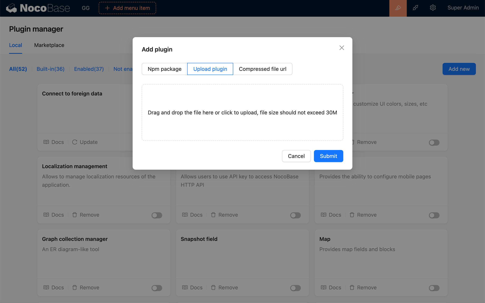
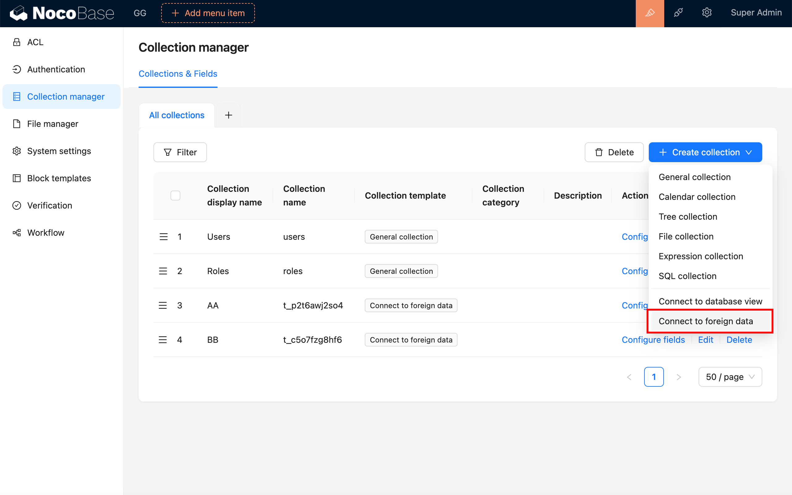
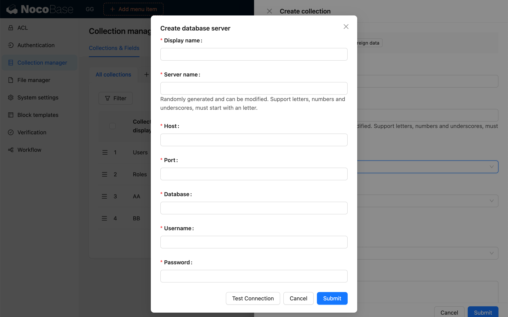
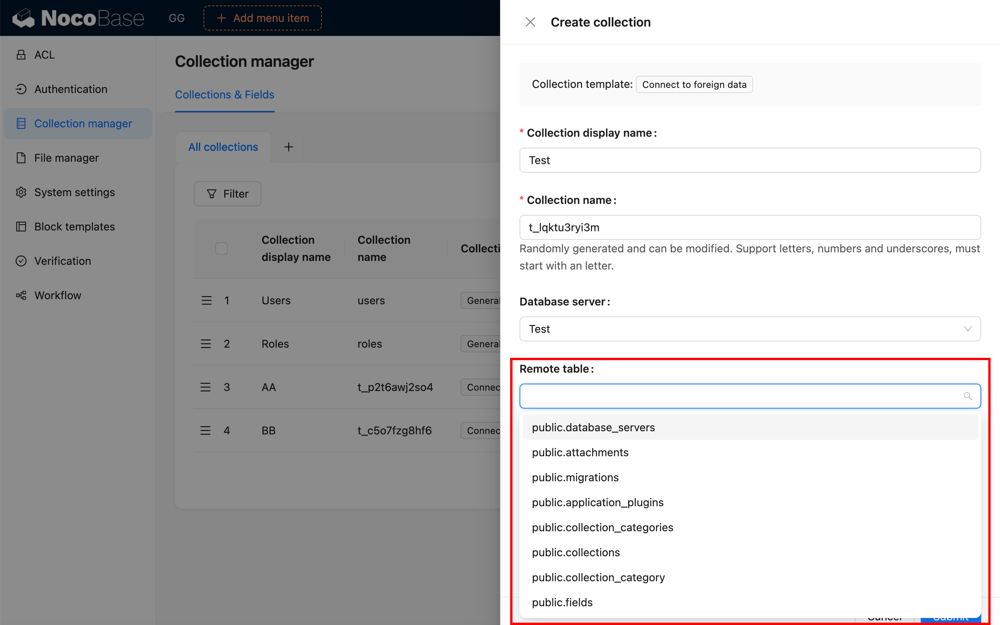
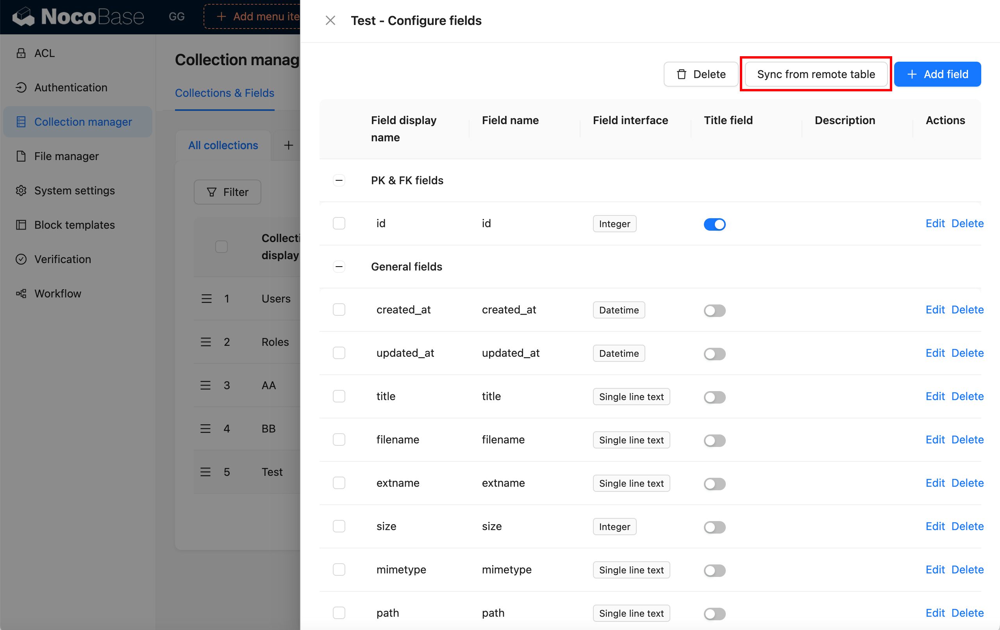
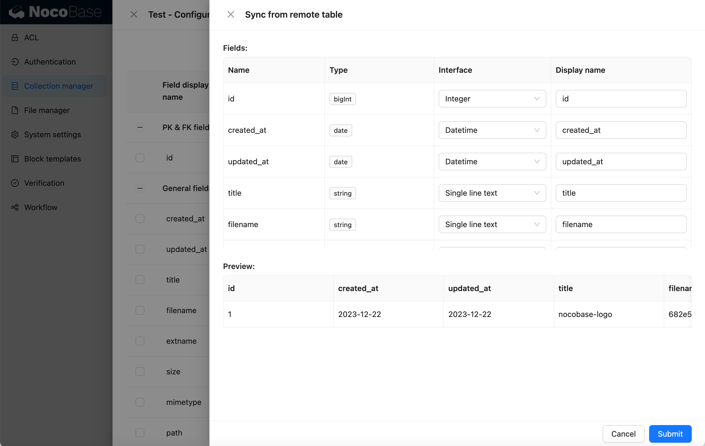
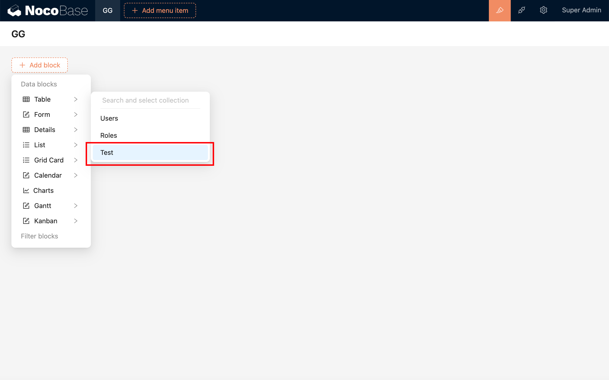

# 连接外部数据表（FDW）

<PluginInfo name="collection-fdw"></PluginInfo>

## 介绍

基于数据库的 foreign data wrapper 实现的连接远程数据表的功能插件。目前支持 MySQL 和 PostgreSQL 数据库。

:::info{title="连接数据源 vs 连接外部数据表"}
- **连接数据源** 指的是与特定数据库或 API 服务建立连接，可以完整的使用数据库的特性或 API 提供的服务；
- **连接外部数据表** 指的是从外部获取数据并映射到本地使用，在数据库里叫 FDW（Foreign Data Wrapper），是一种数据库技术，侧重于将远程表当做本地表使用，只能一张一张表的连接。因为是远程访问，所以在使用时会有各种约束和局限。

二者也可以配合使用，前者用于建立与数据源的连接，后者用于跨数据源访问。例如，连接了某个 PostgreSQL 数据源，这个数据源里有某个表是基于 FDW 创建的外部数据表。
:::

### MySQL

MySQL 通过 `federated` 引擎，需要激活，支持连接远程 MySQL 及其协议兼容数据库，如 MariaDB。详情文档参考 [Federated Storage Engine](https://dev.mysql.com/doc/refman/8.0/en/federated-storage-engine.html)。

### PostgreSQL

在 PostgreSQL 中，可通过不同类型的 `fdw` 扩展来支持不同的远程数据类型，目前支持的扩展有：

- [postgres_fdw](https://www.postgresql.org/docs/current/postgres-fdw.html)：在 PostgreSQL 中连接远程 PostgreSQL 数据库。
- [mysql_fdw(开发中)](https://github.com/EnterpriseDB/mysql_fdw)：在 PostgreSQL 中连接远程 MySQL 数据库。
- 其余类型的 fdw 扩展，可参考 [PostgreSQL Foreign Data Wrappers](https://wiki.postgresql.org/wiki/Foreign_data_wrappers)，接入 NocoBase 需要在代码中实现相应的适配接口。

## 安装

前提条件

- 如果 NocoBase 的主数据库是 MySQL，则需要激活 `federated`，参考 [MySQL 如何启用 federated 引擎](./enable-federated.md)

然后通过插件管理器安装并激活插件

## 使用手册

在「数据表管理 > 创建数据表」 下拉中，选择「连接外部数据」

在「数据库服务」下拉选项中，选择已存在的数据库服务，或者「创建数据库服务」

创建数据库服务

选择数据库服务之后， 在「远程表」的下拉选项中，选择需要连接的数据表。

配置字段信息

如果远程表有结构变化，也可以「从远程表同步」

远程表同步

最后，在界面里显示

