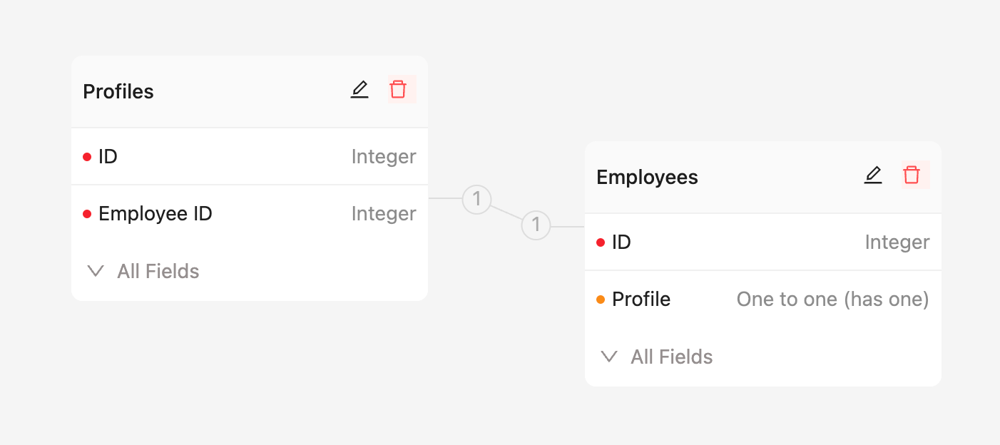

# 一对一

员工和个人资料的关系，每个员工只能有一条个人资料记录，而每条个人资料记录也只能对应一个员工，这种情况下，员工和个人资料是一对一关系。

一对一的外键放在源表或目标表里都可以，如果表示的「有一个」，外键放目标表里更合适；如果表示的「所属关系」，那外键放在源表里更合适。

例如上述例子，员工只有一条个人资料，个人资料属于员工，所以这个外键适合放在个人资料表里。

## 一对一（有一个）

表示某员工有一条个人资料记录

ER 关系

字段配置

## 一对一（所属关系）

表示某条个人资料属于某员工

ER 关系

字段配置

## 参数说明

### Source collection

源表，也就是当前字段所在表。

### Target collection

目标表，与哪个表关联。

### Foreign key

用于建立两个表之间的关联。一对一的外键放在源表或目标表里都可以，如果表示的「有一个」，外键放目标表里更合适；如果表示的「所属关系」，那外键放在源表里更合适。

### Source key <- Foreign key（外键在目标表）

外键约束引用的字段，必须具备唯一性。当外键放在目标时，表示「有一个」。

### Target key <- Foreign key（外键在源表）

外键约束引用的字段，必须具备唯一性。当外键放在源表时，表示「所属关系」

### ON DELETE

ON DELETE 是指在删除父表中的记录时对相关子表中的外键引用的操作规则，它是用于定义外键约束时的一个选项。常见的 ON DELETE 选项包括：

- CASCADE：当删除父表中的记录时，自动删除子表中与之关联的所有记录。
- SET NULL：当删除父表中的记录时，将子表中与之关联的外键值设为 NULL。
- RESTRICT：默认选项，当试图删除父表中的记录时，如果存在与之关联的子表记录，则拒绝删除父表记录。
- NO ACTION：与 RESTRICT 类似，如果存在与之关联的子表记录，则拒绝删除父表记录。
